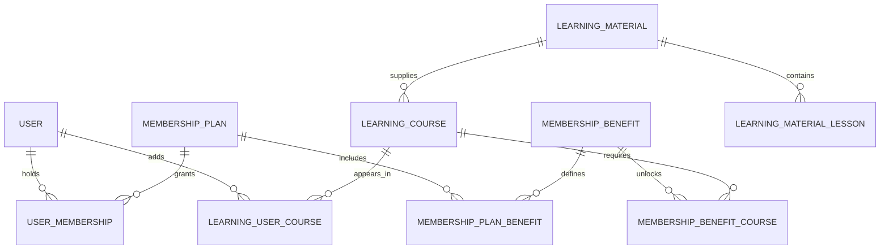

# 会员管理表结构设计

## 设计边界

现有的 `user` 表继续只保存账号、登录方式和后台角色。会员不是角色：
`admin` 仍表示后台权限，会员资格由独立记录决定。这样不会把
`learner`、`premium_learner` 一类业务状态混进权限判断。

会员配置层使用以下三个表，正好对应后台的三个配置页面；课程权益绑定在第 5 节单独定义。

| 表 | 用途 | 后台页面 |
| --- | --- | --- |
| `membership_plan` | 会员等级或会员产品，例如免费会员、月卡、年卡 | 会员管理 |
| `membership_benefit` | 可复用的权益目录，例如全部课程、AI 纠错次数、下载额度 | 权益管理 |
| `membership_plan_benefit` | 某会员包含哪些权益，以及该会员下的额度值 | 会员权益配置 |

另外需要 `user_membership` 记录用户实际获得的会员资格和有效期。
它不属于配置页，但没有它就无法判断某个用户当前享有哪些权益，也无法保留续费、赠送和过期历史。



## 1. 会员等级表：`membership_plan`

一条记录代表一个可配置会员产品，而不是某个具体用户。例如：免费会员、月度会员、年度会员。

| 字段 | 说明 |
| --- | --- |
| `plan_code` | 稳定业务编码，如 `free`、`monthly`、`annual`；创建后不改 |
| `name` / `name_en` | 展示名称 |
| `tier_rank` | 等级优先级，用于排序和比较会员等级 |
| `billing_cycle` / `duration_days` | `free`、`manual`、`monthly`、`quarterly`、`yearly`、`lifetime` 等发放或计费周期 |
| `price` / `currency` | 当前展示价；支付订单独立建表后再保留价格快照 |
| `status` | `draft`、`active`、`inactive`、`archived`；已发放的会员只允许停用或归档，不物理删除 |
| `is_default` | 新注册用户的默认会员；服务层保证同时最多一条 |

```sql
CREATE TABLE `membership_plan` (
    `id` BIGINT UNSIGNED NOT NULL AUTO_INCREMENT COMMENT '会员等级主键ID',
    `plan_code` VARCHAR(64) NOT NULL COMMENT '稳定业务编码，例如 free、monthly、annual',
    `name` VARCHAR(100) NOT NULL COMMENT '会员名称',
    `name_en` VARCHAR(100) DEFAULT NULL COMMENT '会员英文名称',
    `description` VARCHAR(500) DEFAULT NULL COMMENT '会员说明',
    `tier_rank` SMALLINT UNSIGNED NOT NULL DEFAULT 0 COMMENT '等级优先级，数值越大等级越高',
    `billing_cycle` VARCHAR(20) NOT NULL DEFAULT 'manual' COMMENT 'free、manual、monthly、quarterly、yearly、lifetime',
    `duration_days` INT UNSIGNED DEFAULT NULL COMMENT '有效天数；终身会员为空',
    `price` DECIMAL(10,2) NOT NULL DEFAULT 0.00 COMMENT '当前展示价格',
    `currency` CHAR(3) NOT NULL DEFAULT 'CNY' COMMENT '币种',
    `icon` VARCHAR(32) DEFAULT NULL COMMENT '展示图标',
    `badge_text` VARCHAR(50) DEFAULT NULL COMMENT '角标文案，例如 推荐',
    `sort_order` INT NOT NULL DEFAULT 0 COMMENT '列表排序，越小越靠前',
    `status` VARCHAR(20) NOT NULL DEFAULT 'draft' COMMENT 'draft、active、inactive、archived',
    `is_default` TINYINT(1) NOT NULL DEFAULT 0 COMMENT '是否为默认会员',
    `created_by` BIGINT UNSIGNED DEFAULT NULL COMMENT '创建管理员ID',
    `created_at` DATETIME NOT NULL DEFAULT CURRENT_TIMESTAMP COMMENT '创建时间',
    `updated_by` BIGINT UNSIGNED DEFAULT NULL COMMENT '最后修改管理员ID',
    `updated_at` DATETIME NOT NULL DEFAULT CURRENT_TIMESTAMP ON UPDATE CURRENT_TIMESTAMP COMMENT '更新时间',

    PRIMARY KEY (`id`),
    UNIQUE KEY `uk_membership_plan_code` (`plan_code`),
    KEY `idx_membership_plan_status_sort` (`status`, `sort_order`),
    KEY `idx_membership_plan_rank` (`tier_rank`),
    CONSTRAINT `fk_membership_plan_created_by`
        FOREIGN KEY (`created_by`) REFERENCES `user` (`id`) ON DELETE SET NULL,
    CONSTRAINT `fk_membership_plan_updated_by`
        FOREIGN KEY (`updated_by`) REFERENCES `user` (`id`) ON DELETE SET NULL
) ENGINE=InnoDB DEFAULT CHARSET=utf8mb4 COLLATE=utf8mb4_unicode_ci COMMENT='会员等级配置表';
```

## 2. 权益表：`membership_benefit`

权益只定义“是什么”和“值应该如何解释”，不绑定某个会员等级。不同等级通过映射表复用同一权益，并配置不同额度。

| 字段 | 说明 |
| --- | --- |
| `benefit_code` | 稳定编码，如 `all_courses`、`ai_feedback_daily`、`download_daily` |
| `benefit_type` | `content_access`、`feature_access`、`quota`、`discount`、`service` |
| `value_type` | `boolean`、`integer`、`decimal`、`string`、`json`，供接口校验权益值 |
| `unit` | 额度单位，如 `times/day`、`items/day`、`percent`；布尔权益为空 |
| `scope_json` | 非课程类权益的适用范围，例如功能编码；使用 `LONGTEXT` 保存 JSON，沿用当前项目的兼容策略 |
| `default_value_json` | 映射未覆盖时使用的默认权益值，例如 `true`、`20`、`{"discount": 0.9}` |

```sql
CREATE TABLE `membership_benefit` (
    `id` BIGINT UNSIGNED NOT NULL AUTO_INCREMENT COMMENT '权益主键ID',
    `benefit_code` VARCHAR(80) NOT NULL COMMENT '稳定业务编码',
    `name` VARCHAR(100) NOT NULL COMMENT '权益名称',
    `name_en` VARCHAR(100) DEFAULT NULL COMMENT '权益英文名称',
    `description` VARCHAR(500) DEFAULT NULL COMMENT '权益说明',
    `benefit_type` VARCHAR(30) NOT NULL COMMENT 'content_access、feature_access、quota、discount、service',
    `value_type` VARCHAR(20) NOT NULL COMMENT 'boolean、integer、decimal、string、json',
    `unit` VARCHAR(50) DEFAULT NULL COMMENT 'times/day、items/day、percent 等',
    `scope_json` LONGTEXT DEFAULT NULL COMMENT '适用范围 JSON',
    `default_value_json` LONGTEXT DEFAULT NULL COMMENT '默认权益值 JSON',
    `icon` VARCHAR(32) DEFAULT NULL COMMENT '展示图标',
    `sort_order` INT NOT NULL DEFAULT 0 COMMENT '列表排序，越小越靠前',
    `status` VARCHAR(20) NOT NULL DEFAULT 'active' COMMENT 'active、inactive、archived',
    `created_by` BIGINT UNSIGNED DEFAULT NULL COMMENT '创建管理员ID',
    `created_at` DATETIME NOT NULL DEFAULT CURRENT_TIMESTAMP COMMENT '创建时间',
    `updated_by` BIGINT UNSIGNED DEFAULT NULL COMMENT '最后修改管理员ID',
    `updated_at` DATETIME NOT NULL DEFAULT CURRENT_TIMESTAMP ON UPDATE CURRENT_TIMESTAMP COMMENT '更新时间',

    PRIMARY KEY (`id`),
    UNIQUE KEY `uk_membership_benefit_code` (`benefit_code`),
    KEY `idx_membership_benefit_status_sort` (`status`, `sort_order`),
    KEY `idx_membership_benefit_type` (`benefit_type`),
    CONSTRAINT `fk_membership_benefit_created_by`
        FOREIGN KEY (`created_by`) REFERENCES `user` (`id`) ON DELETE SET NULL,
    CONSTRAINT `fk_membership_benefit_updated_by`
        FOREIGN KEY (`updated_by`) REFERENCES `user` (`id`) ON DELETE SET NULL
) ENGINE=InnoDB DEFAULT CHARSET=utf8mb4 COLLATE=utf8mb4_unicode_ci COMMENT='会员权益配置表';
```

## 3. 会员权益映射表：`membership_plan_benefit`

该表表达“某会员等级得到某项权益，以及具体得到多少”。`grant_value_json` 为 `NULL` 时继承权益表的默认值；有值时覆盖默认值。

例如，`ai_feedback_daily` 的权益默认值可为 `5`，年度会员的映射可覆盖为 `30`。

```sql
CREATE TABLE `membership_plan_benefit` (
    `id` BIGINT UNSIGNED NOT NULL AUTO_INCREMENT COMMENT '会员权益映射主键ID',
    `membership_plan_id` BIGINT UNSIGNED NOT NULL COMMENT '会员等级ID',
    `benefit_id` BIGINT UNSIGNED NOT NULL COMMENT '权益ID',
    `grant_value_json` LONGTEXT DEFAULT NULL COMMENT '该会员下的权益值 JSON；为空时使用默认权益值',
    `is_enabled` TINYINT(1) NOT NULL DEFAULT 1 COMMENT '是否对该会员生效',
    `sort_order` INT NOT NULL DEFAULT 0 COMMENT '会员详情页展示排序',
    `created_by` BIGINT UNSIGNED DEFAULT NULL COMMENT '创建管理员ID',
    `created_at` DATETIME NOT NULL DEFAULT CURRENT_TIMESTAMP COMMENT '创建时间',
    `updated_by` BIGINT UNSIGNED DEFAULT NULL COMMENT '最后修改管理员ID',
    `updated_at` DATETIME NOT NULL DEFAULT CURRENT_TIMESTAMP ON UPDATE CURRENT_TIMESTAMP COMMENT '更新时间',

    PRIMARY KEY (`id`),
    UNIQUE KEY `uk_membership_plan_benefit` (`membership_plan_id`, `benefit_id`),
    KEY `idx_membership_plan_benefit_enabled_sort`
        (`membership_plan_id`, `is_enabled`, `sort_order`),
    KEY `idx_membership_plan_benefit_benefit` (`benefit_id`),
    CONSTRAINT `fk_membership_plan_benefit_plan`
        FOREIGN KEY (`membership_plan_id`) REFERENCES `membership_plan` (`id`) ON DELETE RESTRICT,
    CONSTRAINT `fk_membership_plan_benefit_benefit`
        FOREIGN KEY (`benefit_id`) REFERENCES `membership_benefit` (`id`) ON DELETE RESTRICT,
    CONSTRAINT `fk_membership_plan_benefit_created_by`
        FOREIGN KEY (`created_by`) REFERENCES `user` (`id`) ON DELETE SET NULL,
    CONSTRAINT `fk_membership_plan_benefit_updated_by`
        FOREIGN KEY (`updated_by`) REFERENCES `user` (`id`) ON DELETE SET NULL
) ENGINE=InnoDB DEFAULT CHARSET=utf8mb4 COLLATE=utf8mb4_unicode_ci COMMENT='会员等级与权益映射表';
```

## 4. 用户会员记录表：`user_membership`

这是运行期表。用户购买、试用、后台赠送或迁移时新增记录；不要直接把 `membership_plan_id` 写到 `user` 表，否则会丢失历史、有效期和续费来源。

当前权益校验始终按“当前有效的用户会员记录 → 会员等级 → 会员权益映射”解析，因此后台调整权益会立即影响该等级的有效会员。服务层保证一个用户同一时刻只有一条标准的 `active` 会员记录；赠送或特殊权益以后可单独增加覆盖记录。

```sql
CREATE TABLE `user_membership` (
    `id` BIGINT UNSIGNED NOT NULL AUTO_INCREMENT COMMENT '用户会员记录主键ID',
    `user_id` BIGINT UNSIGNED NOT NULL COMMENT '用户ID',
    `membership_plan_id` BIGINT UNSIGNED NOT NULL COMMENT '会员等级ID',
    `status` VARCHAR(20) NOT NULL DEFAULT 'pending' COMMENT 'pending、active、expired、cancelled、revoked',
    `source` VARCHAR(30) NOT NULL DEFAULT 'manual' COMMENT 'manual、purchase、trial、gift、migration、signup',
    `starts_at` DATETIME NOT NULL COMMENT '生效时间',
    `ends_at` DATETIME DEFAULT NULL COMMENT '到期时间；终身会员为空',
    `auto_renew` TINYINT(1) NOT NULL DEFAULT 0 COMMENT '是否自动续费',
    `external_reference` VARCHAR(100) DEFAULT NULL COMMENT '支付单号或外部发放编号',
    `granted_by` BIGINT UNSIGNED DEFAULT NULL COMMENT '发放管理员ID',
    `cancelled_at` DATETIME DEFAULT NULL COMMENT '取消时间',
    `cancel_reason` VARCHAR(500) DEFAULT NULL COMMENT '取消或撤销原因',
    `created_at` DATETIME NOT NULL DEFAULT CURRENT_TIMESTAMP COMMENT '创建时间',
    `updated_at` DATETIME NOT NULL DEFAULT CURRENT_TIMESTAMP ON UPDATE CURRENT_TIMESTAMP COMMENT '更新时间',

    PRIMARY KEY (`id`),
    UNIQUE KEY `uk_user_membership_external_reference` (`external_reference`),
    KEY `idx_user_membership_user_status_time` (`user_id`, `status`, `starts_at`, `ends_at`),
    KEY `idx_user_membership_expiry` (`status`, `ends_at`),
    KEY `idx_user_membership_plan` (`membership_plan_id`),
    CONSTRAINT `fk_user_membership_user`
        FOREIGN KEY (`user_id`) REFERENCES `user` (`id`) ON DELETE CASCADE,
    CONSTRAINT `fk_user_membership_plan`
        FOREIGN KEY (`membership_plan_id`) REFERENCES `membership_plan` (`id`) ON DELETE RESTRICT,
    CONSTRAINT `fk_user_membership_granted_by`
        FOREIGN KEY (`granted_by`) REFERENCES `user` (`id`) ON DELETE SET NULL
) ENGINE=InnoDB DEFAULT CHARSET=utf8mb4 COLLATE=utf8mb4_unicode_ci COMMENT='用户实际会员记录表';
```

## 5. 权益与课程、我的课程的关系

权益负责回答“用户能不能学习这门课”，我的课程负责回答“用户是否把这门课加入自己的学习列表”。两者不能合并：会员到期时课程访问应立即锁定，但用户的选课和学习进度应保留，续费后可以继续学习。

当前全课程会员的学习页提供前 **2** 个教材课时的试看。没有有效会员的用户打开课程时，前两课正常显示；从第 3 课开始接口只返回课时目录和锁定状态，不返回正文。客户端点击锁定课时会提示“升级会员即可解锁”，有效会员则可学习全部课时。

### 5.1 `learning_course` 关联多本教材

课程面向学习者、会员权益和“我的课程”；教材面向内容编排。一门 `learning_course` 可以关联多本完整的 `learning_material`，通过 `learning_course_material` 保存课程内教材顺序；不会直接关联教材下的某一课、某张卡片或某个句子。教材下的内容统一称为“课时”，使用 `learning_material_lesson` 管理；每个课时再关联既有的具体内容根记录。

```text
学习区域 → 学习主题 → learning_course
                              ↓
              learning_course_material（课程内教材顺序）
                              ↓
                  learning_material（整本教材）
                              ↓
                  learning_material_lesson（课时）
                              ↓
                      具体内容记录及其子项

英文课本课程 → 人教版三年级上册 → Unit 1 → english_textbook_lesson → 多条课文句子
日常对话课程 → Learn and Talk III → Lesson 8 → 对话课时根记录 → 多条对话内容
笔记课程 → 旅行英语笔记合集 → 出入境 → english_note → 多张笔记卡片
```

“私人专区 → 我的英语笔记”是个人内容入口的例外：`my-english-notes` 仍使用 `learning_topic` 管理目录和排序，但学习端直接进入现有 `notes` 资源列表，不创建平台 `learning_course`、教材或会员权益映射。它与公开笔记教材分开，避免把个人笔记当作平台课程发布。

#### 教材表：`learning_material`

每条记录代表一本教材、一个题库、一个卡片集或一个笔记合集；`topic_id` 表示教材所属专题。教材只管理目录、封面和发布状态，不存放逐条学习正文。

```sql
CREATE TABLE `learning_material` (
    `id` BIGINT UNSIGNED NOT NULL AUTO_INCREMENT COMMENT '教材主键ID',
    `topic_id` BIGINT UNSIGNED NOT NULL COMMENT '所属学习主题ID',
    `material_code` VARCHAR(120) NOT NULL COMMENT '主题内稳定教材编码',
    `title` VARCHAR(255) NOT NULL COMMENT '教材名称',
    `title_en` VARCHAR(255) DEFAULT NULL COMMENT '教材英文名称',
    `summary` TEXT DEFAULT NULL COMMENT '教材简介',
    `material_type` VARCHAR(50) NOT NULL COMMENT 'textbook、dialogue、note_collection、card_set、phonics、exam 等',
    `publisher` VARCHAR(200) DEFAULT NULL COMMENT '出版社、来源或作者',
    `version_name` VARCHAR(100) DEFAULT NULL COMMENT '版本、册别或级别',
    `cover_url` VARCHAR(500) DEFAULT NULL COMMENT '教材封面',
    `difficulty_code` VARCHAR(50) DEFAULT NULL COMMENT '难度编码',
    `estimated_minutes` INT UNSIGNED DEFAULT NULL COMMENT '整本教材预计学习分钟数',
    `sort_order` INT NOT NULL DEFAULT 0 COMMENT '专题内排序',
    `is_published` TINYINT(1) NOT NULL DEFAULT 1 COMMENT '是否对学习者可见',
    `created_by` BIGINT UNSIGNED DEFAULT NULL COMMENT '创建管理员ID',
    `created_at` DATETIME NOT NULL DEFAULT CURRENT_TIMESTAMP COMMENT '创建时间',
    `updated_by` BIGINT UNSIGNED DEFAULT NULL COMMENT '最后修改管理员ID',
    `updated_at` DATETIME NOT NULL DEFAULT CURRENT_TIMESTAMP ON UPDATE CURRENT_TIMESTAMP COMMENT '更新时间',

    PRIMARY KEY (`id`),
    UNIQUE KEY `uk_learning_material_topic_code` (`topic_id`, `material_code`),
    KEY `idx_learning_material_topic_published_order`
        (`topic_id`, `is_published`, `sort_order`),
    CONSTRAINT `fk_learning_material_topic`
        FOREIGN KEY (`topic_id`) REFERENCES `learning_topic` (`id`) ON DELETE RESTRICT,
    CONSTRAINT `fk_learning_material_created_by`
        FOREIGN KEY (`created_by`) REFERENCES `user` (`id`) ON DELETE SET NULL,
    CONSTRAINT `fk_learning_material_updated_by`
        FOREIGN KEY (`updated_by`) REFERENCES `user` (`id`) ON DELETE SET NULL
) ENGINE=InnoDB DEFAULT CHARSET=utf8mb4 COLLATE=utf8mb4_unicode_ci COMMENT='学习教材表';
```

#### 教材课时表：`learning_material_lesson`

每条记录代表教材中的一个单元、课文、对话课或笔记章节。`source_resource + source_reference_id` 指向该课时的内容根记录，而不是指向每个子项。

```sql
CREATE TABLE `learning_material_lesson` (
    `id` BIGINT UNSIGNED NOT NULL AUTO_INCREMENT COMMENT '教材课时主键ID',
    `material_id` BIGINT UNSIGNED NOT NULL COMMENT '所属教材ID',
    `lesson_code` VARCHAR(120) NOT NULL COMMENT '教材内稳定课时编码',
    `title` VARCHAR(255) NOT NULL COMMENT '课时标题',
    `title_en` VARCHAR(255) DEFAULT NULL COMMENT '课时英文标题',
    `summary` TEXT DEFAULT NULL COMMENT '课时简介',
    `source_resource` VARCHAR(80) DEFAULT NULL COMMENT '内容资源编码，例如 textbook、notes、dialogues',
    `source_reference_id` BIGINT UNSIGNED DEFAULT NULL COMMENT '内容根记录ID，例如 english_textbook_lesson.id、english_note.id',
    `content_json` LONGTEXT DEFAULT NULL COMMENT '无旧内容表时的自包含课时内容 JSON',
    `estimated_minutes` SMALLINT UNSIGNED DEFAULT NULL COMMENT '预计学习分钟数',
    `sort_order` INT NOT NULL DEFAULT 0 COMMENT '教材内排序',
    `is_published` TINYINT(1) NOT NULL DEFAULT 1 COMMENT '是否对学习者可见',
    `created_by` BIGINT UNSIGNED DEFAULT NULL COMMENT '创建管理员ID',
    `created_at` DATETIME NOT NULL DEFAULT CURRENT_TIMESTAMP COMMENT '创建时间',
    `updated_by` BIGINT UNSIGNED DEFAULT NULL COMMENT '最后修改管理员ID',
    `updated_at` DATETIME NOT NULL DEFAULT CURRENT_TIMESTAMP ON UPDATE CURRENT_TIMESTAMP COMMENT '更新时间',

    PRIMARY KEY (`id`),
    UNIQUE KEY `uk_learning_material_lesson_code` (`material_id`, `lesson_code`),
    KEY `idx_learning_material_lesson_material_published_order`
        (`material_id`, `is_published`, `sort_order`),
    KEY `idx_learning_material_lesson_source` (`source_resource`, `source_reference_id`),
    CONSTRAINT `fk_learning_material_lesson_material`
        FOREIGN KEY (`material_id`) REFERENCES `learning_material` (`id`) ON DELETE CASCADE,
    CONSTRAINT `fk_learning_material_lesson_created_by`
        FOREIGN KEY (`created_by`) REFERENCES `user` (`id`) ON DELETE SET NULL,
    CONSTRAINT `fk_learning_material_lesson_updated_by`
        FOREIGN KEY (`updated_by`) REFERENCES `user` (`id`) ON DELETE SET NULL
) ENGINE=InnoDB DEFAULT CHARSET=utf8mb4 COLLATE=utf8mb4_unicode_ci COMMENT='教材课时表';
```

`source_resource + source_reference_id` 是跨旧内容表的多态引用，无法建立一个统一数据库外键；服务层负责校验根记录存在、内容可用及其子内容读取规则。例如 `textbook:12` 指向 `english_textbook_lesson.id = 12`，然后加载 `lesson_id = 12` 的句子；`notes:24` 指向 `english_note.id = 24`，然后加载 `note_id = 24` 的卡片。

#### 课程关联教材

`learning_course_material` 是课程与教材的正式多对多关联，并保存课程内教材顺序。`learning_course.topic_id` 用于课程在专题或专区中的展示、筛选和排序，不限制关联教材必须来自同一专题。原有 `learning_course.material_id` 仅保留为兼容字段，始终镜像第一本关联教材；新接口读写 `material_ids` 和 `materials`。

```sql
CREATE TABLE `learning_course_material` (
    `id` BIGINT UNSIGNED NOT NULL AUTO_INCREMENT,
    `course_id` BIGINT UNSIGNED NOT NULL,
    `material_id` BIGINT UNSIGNED NOT NULL,
    `sort_order` INT NOT NULL DEFAULT 0 COMMENT '课程内教材排序',
    PRIMARY KEY (`id`),
    UNIQUE KEY `uk_learning_course_material` (`course_id`, `material_id`),
    KEY `idx_learning_course_material_course_order` (`course_id`, `sort_order`),
    KEY `idx_learning_course_material_material` (`material_id`, `sort_order`),
    FOREIGN KEY (`course_id`) REFERENCES `learning_course` (`id`) ON DELETE CASCADE,
    FOREIGN KEY (`material_id`) REFERENCES `learning_material` (`id`) ON DELETE RESTRICT
);
```

课程打开时按 `learning_course_material.sort_order` 查询每本教材和其下的已发布课时，并串成同一门课的学习顺序。`learning_progress` 仍以课程为单位，`learning_progress_item` 使用 `lesson:{lesson_id}` 或具体内容的稳定键及 `item_reference_id` 记录学习到哪一课、哪一条内容，因此不需要课程逐行关联内容。

当前只有学习笔记需要私有/共享判断：引用 `notes` 课时时，`english_note.share_status` 必须为 `1`，并且加载时只返回 `english_note_item.share_status = 1` 的卡片；私有笔记和私有卡片不能通过教材课时访问。儿童卡片、自然拼读、课本、日常句子、词汇、面试题和日常口语对话均视为平台教材，只沿用各自已有的启用或发布状态。`everyday_sentence` 与 `interview_question` 现有的同名 `share_status` 是历史字段，不参与课程私有判断。

现有 `learning_course.content_resource`、`content_reference_id` 和 `content_json` 保留为迁移兼容字段。迁移时，为旧课程创建一本教材和对应课时，再写入一条 `learning_course_material`；新课程不再直接使用这三个字段。

### 5.2 课程访问策略与权益课程映射

在已有的 `learning_course` 增加访问策略。现有课程默认 `free`，不会影响当前学习功能；需要会员的课程明确标为 `benefit`。

```sql
ALTER TABLE `learning_course`
    ADD COLUMN `access_policy` VARCHAR(20) NOT NULL DEFAULT 'free'
        COMMENT 'free、benefit；benefit 表示必须拥有课程访问权益' AFTER `is_published`,
    ADD KEY `idx_learning_course_access_published`
        (`access_policy`, `is_published`, `topic_id`);
```

`membership_benefit_course` 是权益与具体课程之间的正式关联。一个权益可以解锁多门课程，一门课程也可以被多个权益解锁；只要用户满足其中任意一个有效权益，就有学习权限。

```sql
CREATE TABLE `membership_benefit_course` (
    `id` BIGINT UNSIGNED NOT NULL AUTO_INCREMENT COMMENT '权益课程映射主键ID',
    `benefit_id` BIGINT UNSIGNED NOT NULL COMMENT '权益ID',
    `course_id` BIGINT UNSIGNED NOT NULL COMMENT '课程ID',
    `access_action` VARCHAR(20) NOT NULL DEFAULT 'study' COMMENT 'study、download；当前课程学习使用 study',
    `is_enabled` TINYINT(1) NOT NULL DEFAULT 1 COMMENT '是否生效',
    `sort_order` INT NOT NULL DEFAULT 0 COMMENT '权益详情中的展示排序',
    `created_by` BIGINT UNSIGNED DEFAULT NULL COMMENT '创建管理员ID',
    `created_at` DATETIME NOT NULL DEFAULT CURRENT_TIMESTAMP COMMENT '创建时间',
    `updated_by` BIGINT UNSIGNED DEFAULT NULL COMMENT '最后修改管理员ID',
    `updated_at` DATETIME NOT NULL DEFAULT CURRENT_TIMESTAMP ON UPDATE CURRENT_TIMESTAMP COMMENT '更新时间',

    PRIMARY KEY (`id`),
    UNIQUE KEY `uk_membership_benefit_course_action`
        (`benefit_id`, `course_id`, `access_action`),
    KEY `idx_membership_benefit_course_course_enabled`
        (`course_id`, `is_enabled`),
    CONSTRAINT `fk_membership_benefit_course_benefit`
        FOREIGN KEY (`benefit_id`) REFERENCES `membership_benefit` (`id`) ON DELETE RESTRICT,
    CONSTRAINT `fk_membership_benefit_course_course`
        FOREIGN KEY (`course_id`) REFERENCES `learning_course` (`id`) ON DELETE RESTRICT,
    CONSTRAINT `fk_membership_benefit_course_created_by`
        FOREIGN KEY (`created_by`) REFERENCES `user` (`id`) ON DELETE SET NULL,
    CONSTRAINT `fk_membership_benefit_course_updated_by`
        FOREIGN KEY (`updated_by`) REFERENCES `user` (`id`) ON DELETE SET NULL
) ENGINE=InnoDB DEFAULT CHARSET=utf8mb4 COLLATE=utf8mb4_unicode_ci COMMENT='会员权益与课程访问映射表';
```

后台选择一个模块或主题来批量绑定权益时，服务层查询其下所有 `learning_course`，在同一事务中写入这张表。这样保留课程外键和唯一约束，不使用无法保证关联完整性的 `target_type + target_id` 多态字段。以后确实需要“新课程自动继承整个主题权益”时，再增加单独的主题级映射表。

### 5.3 我的课程表：`learning_user_course`

`learning_progress` 已保存课程进度，但它不表达“用户主动添加了哪些课程”。`learning_user_course` 只保存选课、归档和最近打开时间；完成度继续从 `learning_progress` 读取，避免两张表保存同一份进度。

```sql
CREATE TABLE `learning_user_course` (
    `id` BIGINT UNSIGNED NOT NULL AUTO_INCREMENT COMMENT '用户课程主键ID',
    `user_id` BIGINT UNSIGNED NOT NULL COMMENT '用户ID',
    `course_id` BIGINT UNSIGNED NOT NULL COMMENT '课程ID',
    `source` VARCHAR(30) NOT NULL DEFAULT 'self_added' COMMENT 'self_added、membership、purchase、gift、admin',
    `source_membership_id` BIGINT UNSIGNED DEFAULT NULL COMMENT '首次加入时对应的用户会员记录ID，仅作来源审计',
    `status` VARCHAR(20) NOT NULL DEFAULT 'active' COMMENT 'active、archived',
    `enrolled_at` DATETIME NOT NULL DEFAULT CURRENT_TIMESTAMP COMMENT '加入我的课程时间',
    `last_opened_at` DATETIME DEFAULT NULL COMMENT '最近打开时间',
    `archived_at` DATETIME DEFAULT NULL COMMENT '归档时间',
    `created_at` DATETIME NOT NULL DEFAULT CURRENT_TIMESTAMP COMMENT '创建时间',
    `updated_at` DATETIME NOT NULL DEFAULT CURRENT_TIMESTAMP ON UPDATE CURRENT_TIMESTAMP COMMENT '更新时间',

    PRIMARY KEY (`id`),
    UNIQUE KEY `uk_learning_user_course` (`user_id`, `course_id`),
    KEY `idx_learning_user_course_user_status_opened`
        (`user_id`, `status`, `last_opened_at`),
    KEY `idx_learning_user_course_course` (`course_id`),
    CONSTRAINT `fk_learning_user_course_user`
        FOREIGN KEY (`user_id`) REFERENCES `user` (`id`) ON DELETE CASCADE,
    CONSTRAINT `fk_learning_user_course_course`
        FOREIGN KEY (`course_id`) REFERENCES `learning_course` (`id`) ON DELETE RESTRICT,
    CONSTRAINT `fk_learning_user_course_source_membership`
        FOREIGN KEY (`source_membership_id`) REFERENCES `user_membership` (`id`) ON DELETE SET NULL
) ENGINE=InnoDB DEFAULT CHARSET=utf8mb4 COLLATE=utf8mb4_unicode_ci COMMENT='用户我的课程表';
```

### 5.4 授权和列表查询规则

1. 用户打开一门课程时，先检查 `learning_course.access_policy`。
2. `free` 课程直接放行；`benefit` 课程需要存在有效的 `user_membership`，且其会员等级的已启用权益，经 `membership_benefit_course` 匹配到该课程的 `study` 权限。
3. 首次打开或点击“加入我的课程”时，使用 `INSERT ... ON DUPLICATE KEY UPDATE` 写入或更新 `learning_user_course.last_opened_at`。
4. 我的课程列表查询 `learning_user_course`、`learning_course` 和 `learning_progress`，同时返回实时计算的 `access_state`：`available`、`preview`、`locked`。
5. 会员过期时不删除 `learning_user_course` 或 `learning_progress`；列表保留课程并显示续费入口，权益恢复后可继续原进度。
6. 前端从课程详情或课程启动接口进入学习内容；接口在完成授权校验后，按 `learning_course_material.sort_order` 查询关联教材和其下已发布课时，再由课时的来源资源服务加载具体内容。试看按整门课程的连续课时数计算，即可跨教材正确锁定第 3 课及之后的内容。`notes` 课时还必须校验笔记为 `share_status = 1`，并只返回 `share_status = 1` 的卡片。

### 5.5 现有学习资料导入教材目录

[`20260926_import_existing_learning_materials.sql`](../sql/20260926_import_existing_learning_materials.sql) 会把已有平台内容导入为“教材 → 课时 → 课程”，并可重复执行。它必须在学习目录和会员教材表迁移完成、且各内容表的数据已导入后执行：

```text
20260925_add_learning_catalog.sql
20260926_add_membership_material_management.sql
20260927_add_learning_course_material_mapping.sql
20260926_import_existing_learning_materials.sql
20260926_restructure_learning_modules.sql
20260926_move_my_notes_to_private_zone.sql
```

导入时按内容的自然合集创建教材：英文课本、自然拼读、每日实用口语、数学卡片各为一本教材；儿童卡片按课本单元分教材；日常口语按章节分教材、按 `lesson_code` 分课时；面试题按题目分类分教材；通用词汇与职场技术词汇分别归入进阶英语和职场专区。每本教材初始自动建立一门课程并关联自身；管理员可在课程开发中将多本教材合并到同一门课程。

当前目录导入会把全部 `learning_course.access_policy` 设为 `benefit`，并创建 `all-courses-access`（全课程学习权益），将全部课程的 `study` 权限绑定到该权益。脚本同时创建非默认的 `all-courses-member`（全课程会员）计划并授予它该权益；管理员可以在后台修改价格和周期，再向指定用户发放该会员。新注册用户不会自动拥有全课程访问权。

教材课时始终引用原内容根记录。例如课本课时引用 `english_textbook_lesson.id`，卡片课时引用对应卡片 ID；一节日常对话引用该 `lesson_code` 的首条记录，运行时会加载同一 `lesson_code` 下的完整对话明细。因此 2,383 条日常对话明细会归并为可学习的对话课，而不会被错误地拆成 2,383 本教材或课程。

“我的英语笔记”固定放在“私人专区”下，学习端从该专题直接进入笔记列表；[`20260926_move_my_notes_to_private_zone.sql`](../sql/20260926_move_my_notes_to_private_zone.sql) 可将已部署目录中的旧入口迁移到该位置。私有笔记不会导入平台教材。只有 `english_note.share_status = 1` 的公开笔记会各自成为一本公开笔记教材；重新执行导入脚本即可补入后来公开的笔记。

## 6. 后台配置页与接口边界

| 页面 | 路由 | 管理内容 |
| --- | --- | --- |
| 会员管理 | `/admin/membership-plans` | 会员等级、价格、周期、排序、状态、默认会员 |
| 权益管理 | `/admin/membership-benefits` | 权益编码、类型、范围、默认值、状态 |
| 会员权益配置 | `/admin/membership-plan-benefits` | 选择会员等级，勾选权益并覆盖额度值 |
| 课程权益绑定 | `/admin/membership-benefit-courses` | 选择权益并绑定单门课程，或按模块、主题批量绑定课程 |
| 教材管理 | `/admin/learning-materials` | 教材目录、专题归属、封面、类型和发布状态 |
| 教材课时管理 | `/admin/learning-materials/{material_id}/lessons` | 教材下的课时、来源根记录和排序 |
| 用户会员记录 | `/admin/user-memberships` | 查询、查看和维护用户已发放的会员记录 |

建议的后台接口为：

```text
GET/POST             /api/admin/membership-plans
GET/PUT/DELETE       /api/admin/membership-plans/{plan_id}
GET/POST             /api/admin/membership-benefits
GET/PUT/DELETE       /api/admin/membership-benefits/{benefit_id}
GET/PUT              /api/admin/membership-plans/{plan_id}/benefits
GET/PUT              /api/admin/membership-benefits/{benefit_id}/courses
GET/POST             /api/admin/learning-materials
GET/PUT/DELETE       /api/admin/learning-materials/{material_id}
GET                  /api/admin/learning-topics
GET/POST             /api/admin/learning-materials/{material_id}/lessons
GET/PUT/DELETE       /api/admin/learning-material-lessons/{lesson_id}
GET                  /api/admin/learning-courses
POST                 /api/admin/learning/courses
PUT/DELETE           /api/admin/learning/courses/{course_id}
GET/POST             /api/admin/users/{user_id}/memberships
PUT                  /api/admin/users/{user_id}/memberships/{membership_id}
GET                  /api/admin/user-memberships
GET/POST/DELETE      /api/learning/my-courses[/{course_id}]
POST                 /api/learning/courses/{course_id}/open
```

会员等级、权益、教材、课程和用户会员记录的集合接口支持 `page`、`page_size` 分页；会员等级和权益支持 `q`、状态筛选，教材和课程支持名称、专题、发布状态等筛选，用户会员记录支持用户、会员等级、状态和发放来源筛选。

权益配置保存使用一次事务替换该会员的映射集合：先校验权益编码、值类型和 JSON，再新增、更新或停用映射，避免出现只写入一半的会员权益。

当前实现提供 Web 后台页面 `/admin/membership`，按会员等级、会员权益、教材与课程、用户会员四个列表页组织；每页先显示查询条件，再显示可分页的列表，并提供详情与修改操作。阿里云发布先执行 [`20260925_add_learning_catalog.sql`](../sql/20260925_add_learning_catalog.sql)、[`20260926_add_membership_material_management.sql`](../sql/20260926_add_membership_material_management.sql) 和 [`20260927_add_learning_course_material_mapping.sql`](../sql/20260927_add_learning_course_material_mapping.sql)，在既有内容数据到位后依次执行 [`20260926_import_existing_learning_materials.sql`](../sql/20260926_import_existing_learning_materials.sql)、[`20260926_restructure_learning_modules.sql`](../sql/20260926_restructure_learning_modules.sql) 和 [`20260926_move_my_notes_to_private_zone.sql`](../sql/20260926_move_my_notes_to_private_zone.sql)。旧课程的直接内容字段保持兼容。

## 7. 后续运行期扩展

当 `quota` 权益真正启用时，再增加 `membership_benefit_usage`，按用户会员、权益和统计周期记录已用额度。例如 AI 口语点评每天 `20` 次、下载每天 `10` 次。支付接入后再增加订单和价格快照；如需对老会员保留旧权益，也在那一阶段增加权益快照。当前课程教材关联、访问策略和会员映射已经能完成教材管理、会员配置、发放、课程授权和我的课程列表，无需先引入这些运行期扩展表。
